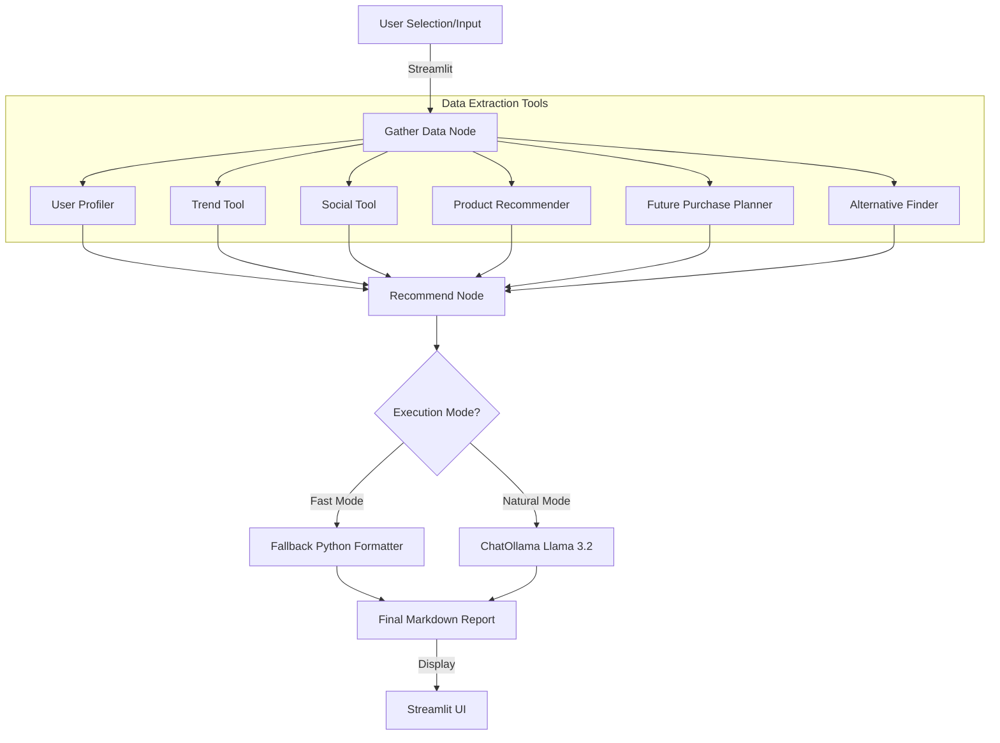

# Project Architecture

The Retail AI Agent uses a graph-based orchestration pattern powered by **LangGraph**. This allows for a clean separation between data gathering and the cognitive step of formatting the final recommendation.

## System Flow

The application follows a linear state transition from data collection to personalized reporting.

## Internal Workflow Details

### 1. Gather Node
The `gather` function invokes all available tools in parallel (or sequence) using the user's ID or profile data. It populates the `AgentState` with:
-   **Profile**: Metadata about the user (budget, brand preference).
-   **Trends**: Local hot items in the user's area.
-   **Social**: Items popular among the user's peer network.
-   **Recommendations**: Top 3 matching products from the catalog.
-   **Alternatives**: Budget-friendly or category-matched alternatives.

### 2. Recommend Node
This node takes the "robotic" raw data from the tools and applies **Conversational Polish**.
-   **System Prompt**: A specialized prompt that forces the LLM to maintain 100% factual accuracy while rephrasing technical reasons into friendly suggestions.
-   **LaTeX Escaping**: All tool outputs and LLM templates use `\$` to ensure Streamlit correctly renders currency without triggering math blocks.

### 3. State Management
`AgentState` is a `TypedDict` that tracks the user payload and tool results through the graph, ensuring a predictable data flow from input to final render.
